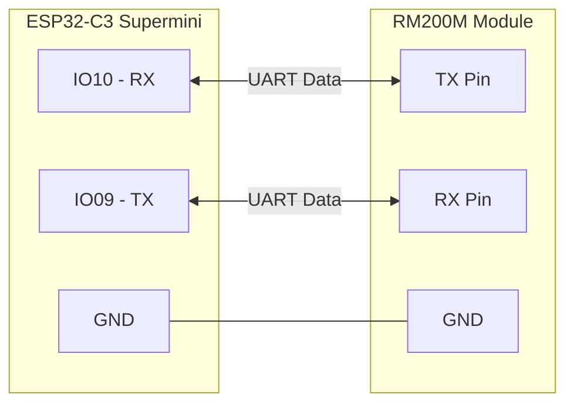
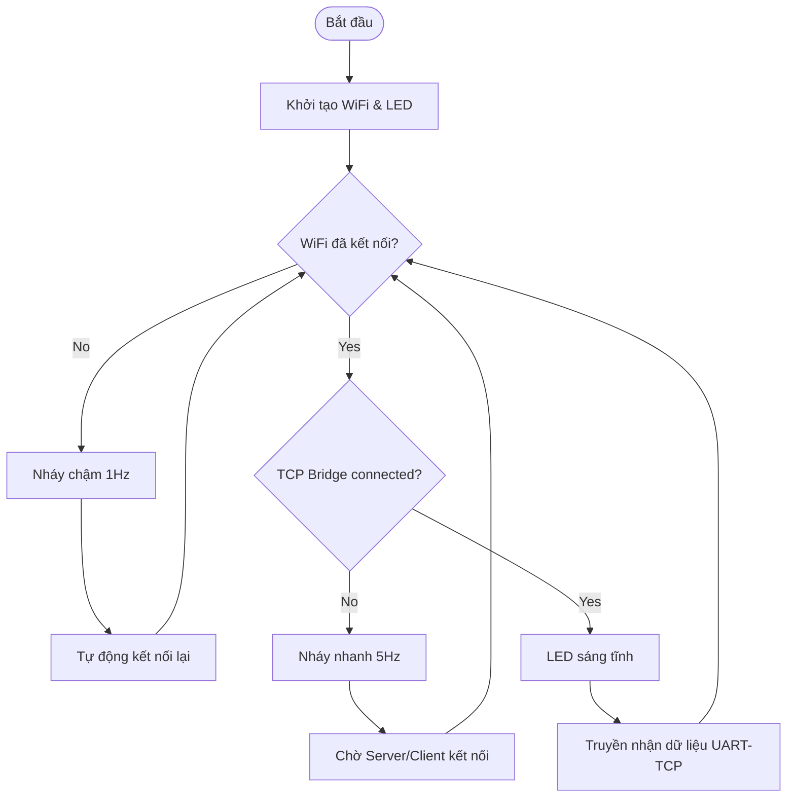
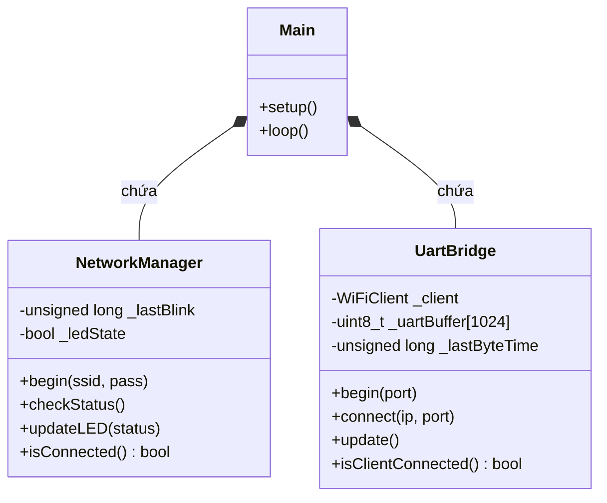
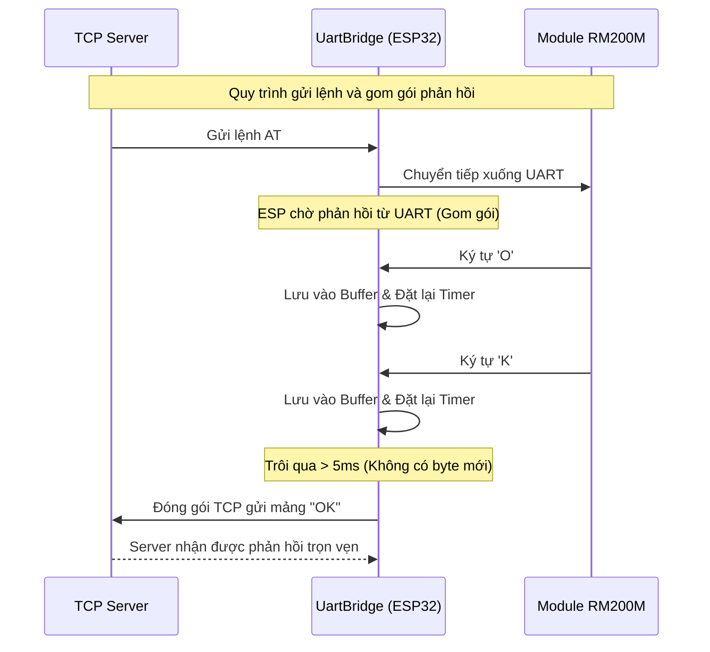

# 1. Mục tiêu

- **Giao tiếp UART không dây với module RM200M** thông qua vi điều khiển.
    
- Vi điều khiển sử dụng: **ESP32-C3 supermini**
    
- Nền tảng sử dụng: **PlatformIO**
    

# 2. Tổng quan về vi điều khiển ESP32-C3 Supermini

![[ESP32-C3-Super-Mini-Pinout-2025.svg|836]]
Thông tin chi tiết đọc thêm ở [[Thông tin chi tiết ESP32-C3 Supermini]]

# 3. Thiết lập phần cứng và môi trường

## 3.1. Sơ đồ kết nối (ESP32-C3 với RM200M)

Do cổng USB Type-C đã chiếm quyền `Serial0` (USB CDC) để nạp code và debug, ta khởi tạo bộ UART phần cứng thứ 2 (`Serial1`) trên ESP32-C3 để giao tiếp với RM200M.



> **⚠️ Lưu ý quan trọng về phần cứng:** > Chân **IO09** của ESP32-C3 (đang dùng làm TX) đồng thời là **chân Strapping (nút BOOT)** quyết định chế độ khởi động của chip. Cần đảm bảo mạch UART của RM200M không kéo chân này xuống mức LOW trong lúc vừa cấp nguồn, nếu không ESP32-C3 sẽ rơi vào trạng thái Download Mode thay vì chạy code chương trình.

## 3.2. Cấu hình PlatformIO (`platformio.ini`)

Để ESP32-C3 Supermini có thể in log ra Serial Monitor qua cổng USB Type-C tích hợp sẵn (không qua IC chuyển đổi CH340), bắt buộc phải thêm các cờ biên dịch (build_flags) kích hoạt chế độ USB CDC.

```platformIO
[env:esp32-c3-devkitm-1]
platform = espressif32
board = esp32-c3-devkitm-1
framework = arduino
monitor_speed = 115200
build_flags = 
	-D ARDUINO_USB_MODE=1
	-D ARDUINO_USB_CDC_ON_BOOT=1
```

# 4. Nguyên lý hoạt động (UART-to-TCP Bridge)

Hệ thống được thiết kế theo hướng đối tượng (OOP) với các nguyên lý hoạt động cốt lõi sau:

1. **Chế độ TCP Client (Hướng Server):** Thay vì giao tiếp trong mạng nội bộ LAN, hệ thống được cấu hình để chủ động kết nối thẳng tới IP và Port của Web Server (do giảng viên cung cấp). Thiết kế này cho phép hệ thống linh hoạt thu thập dữ liệu từ vệ tinh và đẩy trực tiếp lên Cloud.
    
2. **Cơ chế Gom gói (UART Aggregation):** Để tránh việc phản hồi từ RM200M bị xé lẻ thành nhiều gói tin TCP (làm sai lệch tập lệnh AT), ESP32 sử dụng một bộ đệm (Buffer). Dữ liệu chỉ được đóng gói gửi qua WiFi khi không nhận thêm byte nào từ UART trong khoảng thời gian timeout là **5ms**.
    
3. **Quản lý LED báo hiệu (GPIO 8):** - **Nháy chậm (1Hz):** Đang tìm kiếm và kết nối WiFi.
    
    - **Nháy nhanh (5Hz):** Đã có WiFi, đang chờ kết nối Bridge tới TCP Server.
        
    - **Sáng tĩnh:** Hệ thống thông suốt, đã kết nối thành công tới Server.



4. Cơ chế Debug Bypass & Local Echo (Hỗ trợ phát triển): 
	- Hệ thống cho phép sử dụng cổng USB CDC (kết nối với phần mềm CuteCom/Serial Monitor trên máy tính) để can thiệp trực tiếp vào luồng dữ liệu. Lệnh AT gõ từ máy tính sẽ được xử lý song song: vừa truyền xuống module RM200M (để cấu hình vệ tinh), vừa hiển thị lại trên màn hình (Local Echo), đồng thời đẩy thẳng lên TCP Server (Bypass) để kiểm thử Backend mà không cần đợi module phần cứng phản hồi.

# 5. Cấu trúc mã nguồn (OOP Design)

Để tăng tính tái sử dụng và dễ dàng bảo trì, mã nguồn được chia thành 2 Lớp (Class) độc lập trong thư mục `lib/`:

- **Lớp `NetworkManager`**: Xử lý toàn bộ logic Wi-Fi (Non-blocking) và tự động Reconnect. Bao bọc các hàm điều khiển LED trạng thái.
    
- **Lớp `UartBridge`**: Quản lý Socket TCP Client, tiếp nhận luồng dữ liệu UART và thực hiện thuật toán Gom gói (Aggregation) trước khi gửi lên Server.
    



### 5.1. File cấu hình trung tâm (`include/config.h`)

Toàn bộ thông số nhạy cảm (WiFi, IP Server) và các hằng số phần cứng được tách riêng để dễ chỉnh sửa khi chuyển giao source code.

```C
#ifndef CONFIG_H
#define CONFIG_H

// --- Cấu hình Wi-Fi ---
#define WIFI_SSID "UIT Public"
#define WIFI_PASS "********" // Mật khẩu được bảo mật

// --- Cấu hình TCP Server (Web của giảng viên) ---
#define SERVER_IP "192.168.1.100" // IP của Server (Thay đổi thực tế)
#define SERVER_PORT 8080          // Port lắng nghe của Server

// --- Cấu hình hệ thống ---
#define DEBUG_BAUD 115200
#define RM200_BAUD 115200
#define RM200_RX_PIN 10
#define RM200_TX_PIN 9
#define STATUS_LED_PIN 8

// --- Tham số Gom gói (Aggregation) ---
#define UART_AGGREGATION_MS 5
#define BUFFER_SIZE 1024

#endif
```

### 5.2. Mã nguồn chính (`src/main.cpp`)

Chương trình chính trở nên rất gọn gàng, đóng vai trò điều phối giữa Mạng và Cầu nối UART.

```C++
#include <Arduino.h>
#include "config.h"
#include "NetworkManager.h"
#include "UartBridge.h"

NetworkManager net;
UartBridge bridge;

void setup() {
    Serial.begin(DEBUG_BAUD);
    unsigned long waitStart = millis();
    while (!Serial && (millis() - waitStart < 3000)) {
        delay(10);
    }
    delay(1000);
    Serial.println("\n--- UART to TCP Server Bridge ---");
    Serial.printf("Debug baud: %d\n", DEBUG_BAUD);
    Serial.printf("UART1 config: baud=%d RX=%d TX=%d\n", RM200_BAUD, RM200_RX_PIN, RM200_TX_PIN);
    net.begin(WIFI_SSID, WIFI_PASS);
}

void loop() {
    // --- ĐỌC LỆNH TỪ CUTECOM (USB) ---
    while (Serial.available()) {
        char c = Serial.read();
        Serial1.write(c);            // Đẩy lệnh xuống module RM200M
        Serial.write(c);             // Local Echo: In ngược lại lên CuteCom
        bridge.injectToServer(c);    // Bypass: Đẩy thẳng lệnh lên Web Server
    }

    net.checkStatus();
    
    // Theo dõi trạng thái WiFi
    static bool lastWifi = false;
    bool currentWifi = net.isConnected();
    if (currentWifi && !lastWifi) { 
        Serial.print("\n--- WiFi Connected! ---\n");
        Serial.printf("Connecting to Server: %s:%d\n", SERVER_IP, SERVER_PORT);
        
        IPAddress targetIP;
        targetIP.fromString(SERVER_IP);
        bridge.connect(targetIP, SERVER_PORT);
    }
    lastWifi = currentWifi;

    bridge.update();

    // --- TÍNH NĂNG THEO DÕI TRẠNG THÁI (Chỉ in 1 lần khi thay đổi) ---
    static bool lastBridge = false;
    bool currentBridge = bridge.isClientConnected();
    
    if (currentBridge != lastBridge) {
        if (currentBridge) {
            Serial.println("\n[STATUS] TCP Bridge is CONNECTED! Ready to transfer data.");
        } else {
            Serial.println("\n[STATUS] TCP Bridge DISCONNECTED! Waiting to reconnect...");
        }
        lastBridge = currentBridge;
    }

    NetStatus currentStatus;
    if (!net.isConnected()) {
        currentStatus = STATUS_WIFI_DISCONNECTED;
    } else if (!bridge.isClientConnected()) {
        currentStatus = STATUS_WIFI_CONNECTED;
    } else {
        currentStatus = STATUS_BRIDGE_CONNECTED;
    }
    net.updateLED(currentStatus);
}
}
```

### 5.3. Mô phỏng thuật toán Gom gói dữ liệu

Biểu đồ tuần tự dưới đây mô tả cách `UartBridge` ngăn chặn tình trạng "xé lẻ" gói tin UART trước khi gửi lên giao thức TCP:



# 6. Quy trình kiểm thử (Testing) & Kết quả

1. **Hiệu năng truyền dẫn:** Nhờ thuật toán **Aggregation 5ms**, các gói tin phản hồi `OK`, `ERROR` hoặc chuỗi dữ liệu dài từ module vệ tinh RM200M luôn được Server nhận đầy đủ trong một lần TCP Read. Khắc phục triệt để lỗi mất ký tự hoặc trễ gói.
    
2. **Độ tin cậy của mạng:** Hệ thống có khả năng tự động khôi phục kết nối (Auto-reconnect). Khi router WiFi khởi động lại hoặc TCP Server bị crash tạm thời, ESP32 sẽ tự phục hồi và kết nối lại sau tối đa 5 giây.
    
3. **Nhiệt độ và năng lượng:** Module ESP32-C3 Supermini hoạt động mát, dòng tiêu thụ dao động ổn định ở mức ~80mA khi đang xử lý truyền dẫn luồng dữ liệu liên tục.
    
