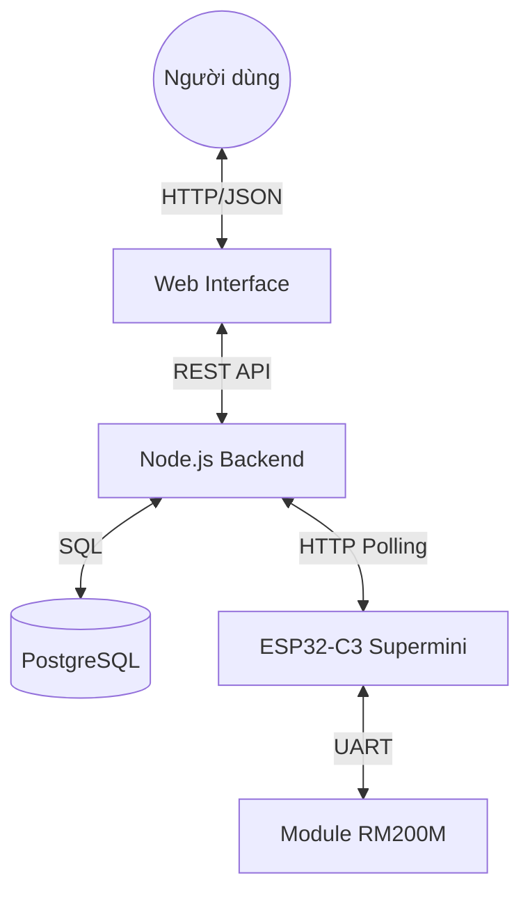

# 1. Mục tiêu

- **Xây dựng giao diện quản lý trên Web (Dashboard)** để điều khiển module RM200M từ xa.
- **Lưu trữ lịch sử lệnh (Logs)** vào cơ sở dữ liệu để phục vụ việc giám sát và phân tích sau này.
- **Triển khai hệ thống bằng Docker** để đảm bảo tính nhất quán giữa các môi trường phát triển và vận hành.

# 2. Kiến trúc hệ thống Web-based Management

Hệ thống được mở rộng thêm tầng Web Server đóng vai trò trung gian giữa người dùng và thiết bị ESP32:

1. **Frontend (Web Browser):** Giao diện người dùng viết bằng HTML/JavaScript (Vanilla), sử dụng cơ chế Polling để cập nhật log thời gian thực.
2. **Backend (Node.js & Express):** Cung cấp các RESTful API để nhận lệnh từ Web và lưu trữ/phản hồi dữ liệu cho ESP32.
3. **Database (PostgreSQL):** Lưu trữ bền vững toàn bộ luồng dữ liệu (Lệnh gửi đi, phản hồi từ module, dữ liệu vệ tinh).



# 3. Chi tiết triển khai Backend (ai_studio_code.js)

Backend được thiết kế tối giản nhưng hiệu quả với các Endpoint chính:

- **`POST /command`**: Nhận lệnh AT từ người dùng trên Web, lưu vào DB và giữ trong biến `pendingCommand`.
- **`GET /command`**: ESP32 gọi định kỳ để lấy lệnh mới nhất về thực thi.
- **`POST /upload`**: ESP32 đẩy phản hồi từ module RM200M lên để lưu vào DB.
- **`GET /logs`**: Web gọi để lấy toàn bộ lịch sử trao đổi dữ liệu.

Cấu trúc bảng dữ liệu `logs`:
```sql
CREATE TABLE logs (
    id SERIAL PRIMARY KEY,
    type TEXT,        -- 'cmd' (lệnh), 'res' (phản hồi OK/ERR), 'data' (dữ liệu)
    content TEXT,     -- Nội dung chi tiết
    timestamp TIMESTAMP DEFAULT CURRENT_TIMESTAMP
);
```

# 4. Giao diện Web (Remote Serial Monitor)

Giao diện được thiết kế theo phong cách Terminal/IDE (Dark Mode) để tối ưu cho việc theo dõi log Serial:

- **Màu sắc phân biệt:** 
    - Xanh dương (`>>`): Lệnh gửi đi từ Server.
    - Xanh lá (`<<`): Phản hồi thành công từ module (OK).
    - Vàng (`<<`): Dữ liệu thô từ vệ tinh.
- **Tính năng:** Tự động cuộn xuống (Auto-scroll), lọc trùng gói tin (De-duplication) và hiển thị trạng thái kết nối (Status Dot).

# 5. Đóng gói và Triển khai (Docker)

Toàn bộ hệ thống Web (App + DB) được đóng gói qua Docker giúp triển khai nhanh chóng chỉ với một lệnh duy nhất.

### 5.1. Dockerfile
Sử dụng image `node:18-alpine` siêu nhẹ để chạy ứng dụng Backend.

### 5.2. Docker Compose
Sử dụng `docker-compose.yml` để điều phối 2 dịch vụ:
- **Service `db`**: Chạy PostgreSQL 15, lưu dữ liệu vào volume `postgres_data`.
- **Service `app`**: Build từ mã nguồn trong thư mục `Web`, kết nối tới dịch vụ `db`.

```yaml
services:
  db:
    image: postgres:15-alpine
    environment:
      POSTGRES_DB: serial_monitor
    ...
  app:
    build: ./Web
    depends_on:
      - db
    ...
```

# 6. Kết quả đạt được

1. **Điều khiển từ xa:** Không cần cắm cáp USB, người dùng có thể gửi lệnh AT cho module RM200M từ bất kỳ trình duyệt nào trong mạng.
2. **Lưu trữ tập trung:** Toàn bộ quá trình giao tiếp được lưu lại, hỗ trợ tốt cho việc debug các lỗi không thường xuyên (intermittent issues).
3. **Môi trường chuẩn hóa:** Với Docker, hệ thống có thể chạy ngay lập tức trên máy của giảng viên hoặc Server Cloud mà không cần cài đặt môi trường Node.js/PostgreSQL thủ công.
